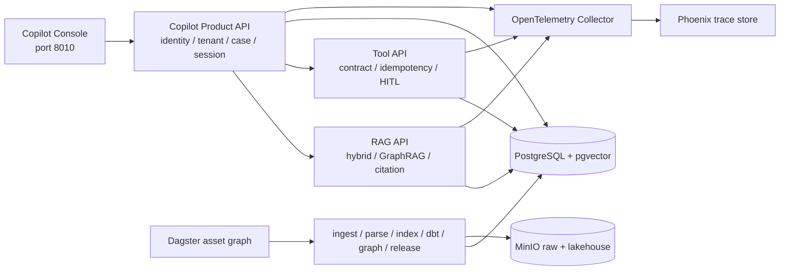

# OmniSupport 企业级 Capstone 产品化架构蓝图

## 1. 产品目标

OmniSupport 不是聊天框套一个 LLM。它是客服坐席的证据与动作控制面：

1. 从真实工单进入问题，而不是脱离业务上下文聊天。
2. 回答必须带可核对的 evidence，证据不足时拒答。
3. 读操作与写操作都走机读 Tool Contract。
4. 高风险动作必须停在 HITL checkpoint，批准后才能恢复执行。
5. 数据、索引、Prompt、图谱和服务版本必须绑定到同一个 release。
6. 每次问答、查询和动作必须能在 Phoenix、审计表和 lineage 表中追责。

本地 Docker Compose 是生产形态的单机参考实现。它验证服务边界、契约、数据链、权限、幂等、审批、可观测和发布闭环；它不冒充多可用区、高可用、云密钥托管或大规模压测后的生产部署。

## 2. 运行架构

### 2.1 用户面

- `apps/copilot_console/`：坐席工作台、证据抽屉、受控动作、审批页、运营页。
- `services/copilot_api/`：产品 BFF 与控制面；负责身份、租户、会话、反馈和服务编排。
- 浏览器不直接访问 PostgreSQL、RAG 内部表或写工具，不能绕过后端策略。

### 2.2 数据面

- `scripts/capstone/generate_demo_data.py`：固定 seed 生成 240 条虚构工单，保留 SLA、优先级、组织、产品线和错误码等真实业务结构。
- `pipelines/ingestion/`：契约校验、幂等 ingest、checkpoint、replay/backfill 证据。
- `pipelines/parse_normalize/`：HTML、PDF、图片、音频和视频解析，生成 chunk 与 evidence anchor。
- `pipelines/indexing/`：写入 pgvector，并绑定 `index_release_id`。
- `analytics/`：dbt staging、intermediate、marts、安全视图与 metric registry。
- `pipelines/graph/` 与 `services/graph/`：图派生资产和 Local/Global/Multi-hop/DRIFT 检索。

### 2.3 控制面

- 数据契约：`contracts/data/`
- 工具契约：`contracts/tools/`
- 产品输出契约：`contracts/product/`
- 发布契约：`contracts/release/`
- 受控执行：`services/tool_api/app/routers/tickets.py`
- 发布治理：`release/`、`rollout/`、`governance/`

## 3. 从课程周次到产品能力

| 周次 | 产品里的实际落点 | 可见结果 |
|---|---|---|
| Week01-02 | Compose、环境、契约、Manifest、PII gate | 输入有边界，迁移和配置可复现 |
| Week03 | ticket/doc ingest、checkpoint、幂等与 replay | 工单和文档真实入库，不靠手填演示表 |
| Week04 | MinIO、Iceberg、snapshot/time travel | 原始对象和可复现数据底座 |
| Week05 | dbt marts、metric registry、KPI Tool | Operations 页面执行受治理指标查询 |
| Week06 | Dagster Capstone 资产图 | UI/CLI 可物化完整依赖链 |
| Week07 | 多模态 parse、chunk、evidence anchor | PDF/图片/音视频进入统一证据模型 |
| Week08 | pgvector + FTS + RRF + citation | Copilot 返回答案、证据和 release/trace |
| Week09 | Skill Pack 与 Registry | 能力可发现、可导出、可版本锁定 |
| Week10 | Tool Contract、幂等、HITL、lineage | 写动作可拦、可批、可恢复、可追责 |
| Week11 | feedback、golden set、回归 gate | 线上反馈能进入后续评测闭环 |
| Week12 | OTel Collector + Phoenix | 从产品请求追到 RAG、Tool 和审批 span |
| Week13 | GraphRAG 路由 | 可选择图检索处理跨文档问题 |
| Week14 | governed release + pointer + rollback | data/index/prompt/graph/service 一起发布 |

## 4. 关键业务链路

### 4.1 证据问答

`POST /api/v1/conversations/{id}/messages`

1. Product API 校验 token 和 conversation tenant。
2. 将用户问题持久化到 `support_message`。
3. 带产品线、角色、可见性和 trace context 调用 RAG API。
4. RAG 执行查询路由、pgvector、FTS、RRF、可选 rerank 和生成。
5. Product API 保存 answer、citations、evidence IDs、confidence 和五类 release ID。
6. 用户反馈写入 `copilot_feedback`，供 Week11 bad-case/回归闭环使用。

### 4.2 受控动作

`POST /api/v1/cases/{ticket_id}/actions`

1. Product API 先验证工单 tenant 和用户角色。
2. Tool API 再验证 service token、actor context 和 Tool Contract。
3. `tool_idempotency` 防止相同 key 重复执行；相同 key 不同参数直接返回冲突。
4. 普通内部备注可直接执行；金融类动作进入 `hitl_approval_request`。
5. 管理员批准后从持久化 payload 恢复，在事务中执行动作。
6. `audit_log`、`agent_action_lineage` 和 Phoenix span 同时留下证据。

### 4.3 受治理指标

Product API 不接收 SQL。请求只允许选择 `metric_registry_v1.yml` 注册的指标、维度和过滤器；Tool API 重新计算比率和加权均值，只查询 dbt 的 `analytics.agent_tool_input_view`，并记录查询 fingerprint 与策略列表。

## 5. 身份、租户与安全边界

- 密码使用 PBKDF2 加盐哈希，不保存明文。
- token 使用 HMAC 签名并带到期时间；生产部署应替换为企业 IdP/OIDC 和短期 token。
- 所有产品表带 `tenant_id`，case、conversation、message、feedback、approval 和 action SQL 在服务端校验租户。
- Product API 到 Tool API 使用内部 service token；生产部署应改为 mTLS 或 workload identity，并从 secret manager 注入。
- 浏览器由 Nginx 设置 CSP、`X-Content-Type-Options`、`Referrer-Policy` 等安全头。
- OTel 默认 `OTEL_CAPTURE_CONTENT=false`，不把原始 Prompt、客户内容或敏感信息写进 trace。
- 高风险动作不能依赖 Prompt 里的“请先询问”，必须由代码策略和审批表强制执行。

安全基线参考 [NIST AI RMF](https://www.nist.gov/itl/ai-risk-management-framework)、[NIST Generative AI Profile](https://nvlpubs.nist.gov/nistpubs/ai/NIST.AI.600-1.pdf) 和 [OWASP GenAI Security Project](https://genai.owasp.org/llm-top-10/)。

## 6. 发布与追溯

产品运行时统一使用：

- `release_id`
- `data_release_id`
- `index_release_id`
- `prompt_release_id`
- `graph_release_id`
- `trace_id`
- `approval_id`
- `lineage_event_id`

`governed_release_manifest` 保存不可变版本绑定，`release_environment_pointer` 表示环境当前激活版本。生产发布必须走 Week14 的签名、评测门禁、灰度和回滚流程；本地 `capstone-bootstrap` 使用 `signature_algorithm=none`，只允许作为 dev 环境证据。

## 7. 本地模式与生产模式

| 能力 | 本地可复现模式 | 生产模式要求 |
|---|---|---|
| 生成 | 无密钥时返回 evidence summary fallback | 配置企业批准模型、限流、超时、预算、内容安全与 provider failover |
| Embedding | `EMBEDDING_MODEL=deterministic`，只验证工程链 | `voyage-2` 或组织批准的 embedding，重建并发布新 index release |
| Rerank | 不安装重模型时回退 RRF | 独立 rerank 服务或固定模型镜像，配置容量和降级策略 |
| 身份 | 预置 PBKDF2 demo user | OIDC/SSO、SCIM、MFA、RBAC/ABAC、密钥轮换 |
| 存储 | 单机 PostgreSQL/MinIO | HA、备份恢复、加密、生命周期、容量和灾备演练 |
| 编排 | 单 Dagster 进程 | daemon、run launcher、队列、并发隔离、告警和值班 |
| 可观测 | 全采样本地 Phoenix | 分层采样、PII 清洗、保留策略、SLO 与告警路由 |

## 8. 验收标准

合格的 Capstone 不能只看页面：

1. `capstone_product_release` 的所有上游 Dagster assets 物化成功。
2. 数据库中 `northstar-demo / data-capstone-v1` 工单恰好 240 条，重复 bootstrap 不翻倍。
3. MinIO 中存在 HTML、PDF、PNG、WAV 和 MP4 原始对象。
4. RAG 返回 Capstone evidence，回答持久化并可反馈。
5. KPI 查询返回已治理行与 audit ID，不接受 raw SQL。
6. 普通动作完成；金融动作必须 awaiting approval，批准后才落库。
7. Phoenix 中能看到 RAG、HITL wait 和 HITL resume 三条完整 trace。
8. Week01-Week14 合同、集成和回归测试继续通过。
