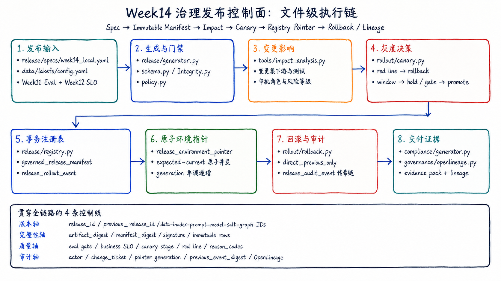

# Week14 Governance and Versioned Release Runbook

Run every command from the latest `omnisupport-copilot` repository root. Docker and Podman use the
same code path; Podman users replace `docker compose` with `podman compose`.



Read the diagram before running the commands: Week14 starts from a release spec, generates an
immutable manifest, runs impact analysis and canary gates, switches the registry pointer atomically,
and keeps rollback, audit and compliance evidence on the same release chain.

## 1. Start PostgreSQL and apply additive migrations

```bash
docker compose --env-file infra/env/.env.local -f infra/docker-compose.yml up -d postgres db_migrate
```

Existing volumes do not replay `docker-entrypoint-initdb.d`, so the repository now uses the
one-shot `db_migrate` service for every additive migration. It records filename and checksum in
`app_schema_migration`, applies `011_week14_governed_release.sql` exactly once, and fails closed if
an already-applied migration file was changed. Do not run `011` manually after this command.

## 2. Generate a manifest from real repository artifacts

```bash
docker compose --profile tools --env-file infra/env/.env.local -f infra/docker-compose.yml run --rm devbox \
  python -m release.generator \
    --spec release/specs/week14_local.yaml \
    --environment dev \
    --created-by "$USER" \
    --git-sha "$(git rev-parse HEAD)" \
    --output-dir artifacts/releases
```

The host injects the checked-out Git SHA because a Docker container cannot resolve the host-only
`.git/worktrees/...` path used by Git worktrees. The command computes every `source_paths` digest
and fails on a missing artifact, failed eval gate, invalid schema or an existing release file. Run
it from a reviewed, clean commit; a SHA identifies committed code, not uncommitted edits. For `prod`, set
`WEEK14_RELEASE_SIGNING_KEY` in the runtime secret store and pass a different `--approved-by`.
CI injects the checked-out commit through `GIT_SHA` or `--git-sha`; the generator never substitutes
a placeholder SHA.

## 3. Generate the impact report before approval

```bash
RELEASE_MANIFEST=$(ls -t artifacts/releases/*.json | head -1)

docker compose --profile tools --env-file infra/env/.env.local -f infra/docker-compose.yml run --rm devbox \
  python -m tools.impact_analysis \
    --candidate "$RELEASE_MANIFEST" \
    --output artifacts/releases/impact-report.json
```

For a real promotion, also pass `--previous` so changed components, downstream services, required
test suites and approval roles are calculated from the actual delta.

## 4. Run a 5% canary decision

```bash
docker compose --profile tools --env-file infra/env/.env.local -f infra/docker-compose.yml run --rm devbox \
  python -m rollout.canary \
    --manifest "$RELEASE_MANIFEST" \
    --observation tests/fixtures/week14/canary_5_percent_pass.json \
    --output artifacts/releases/canary-5.json
```

Expected decision: `promote`. Replacing the observation with
`canary_red_line_breach.json` returns `rollback` even though answer quality improved. This proves
red-line-first behavior. The fixture intentionally contains metrics only; the evaluator binds the
decision to the digest-verified manifest release ID. If a telemetry payload already carries a
different `release_id`, the command fails closed.

## 5. Register, promote and rollback

Register and promote through the same CLI used by CI/deployment controllers:

```bash
docker compose --profile tools --env-file infra/env/.env.local -f infra/docker-compose.yml run --rm devbox \
  python -m release.registry register --manifest "$RELEASE_MANIFEST"

RELEASE_ID=$(
  docker compose --profile tools --env-file infra/env/.env.local -f infra/docker-compose.yml run --rm devbox \
    python -c "import json; print(json.load(open('$RELEASE_MANIFEST'))['metadata']['release_id'])"
)

docker compose --profile tools --env-file infra/env/.env.local -f infra/docker-compose.yml run --rm devbox \
  python -m release.registry record-rollout \
    --release-id "$RELEASE_ID" \
    --decision artifacts/releases/canary-5.json \
    --actor "$USER"

docker compose --profile tools --env-file infra/env/.env.local -f infra/docker-compose.yml run --rm devbox \
  python -m release.registry promote \
    --release-id "$RELEASE_ID" \
    --actor "$USER"
```

The dev path above stays short for classroom use. A production release cannot switch the stable
pointer until the latest recorded decisions for 5%, 25%, 50% and 100% are all `promote`. Record the
real observation for each stage in order; `hold`, `rollback`, missing stages, out-of-order stages and
a decision bound to another release all block promotion in code, not just by convention.

Rollback changes the single pointer and therefore all six component versions together:

```bash
docker compose --profile tools --env-file infra/env/.env.local -f infra/docker-compose.yml run --rm devbox \
  python -m rollout.rollback \
    --current-release-id omni-dev-v2026.07.20-002 \
    --target-release-id omni-dev-v2026.07.20-001 \
    --actor incident-commander \
    --reason canary_red_line
```

The target must be the direct previous release and the current pointer must match exactly. These two
checks prevent accidental rollback to an unrelated release and lost updates between operators.

Emit the same six component versions to an OpenLineage-compatible backend or a local fixture:

```bash
docker compose --profile tools --env-file infra/env/.env.local -f infra/docker-compose.yml run --rm devbox \
  python -m governance.openlineage \
    --manifest "$RELEASE_MANIFEST" \
    --output artifacts/releases/openlineage-release-event.json
```

## 6. Generate the compliance evidence pack

```bash
docker compose --profile tools --env-file infra/env/.env.local -f infra/docker-compose.yml run --rm devbox \
  python -m release.compliance.generator \
    --manifest "$RELEASE_MANIFEST" \
    --evidence artifacts/releases/impact-report.json \
    --evidence evals/baselines/week11_baseline_metrics.json \
    --evidence artifacts/releases/canary-5.json \
    --output-dir artifacts/compliance
```

For production, missing impact, eval or rollout evidence makes the pack fail. Runtime artifacts stay
under ignored `artifacts/`; only contracts, code, policies and examples belong in Git.

## 7. Tests

```bash
docker compose --profile tools --env-file infra/env/.env.local -f infra/docker-compose.yml run --rm devbox \
  pytest tests/contract/test_week14_governed_release_contracts.py \
         tests/integration/test_week14_governed_release.py -v
```

The PostgreSQL test applies migration `011`, registers two signed releases, rejects a stale pointer,
promotes the second release, rolls back to the first and verifies generation `3`.

## Troubleshooting

| Symptom | Cause | Action |
|---|---|---|
| `relation governed_release_manifest does not exist` | `db_migrate` did not complete on this volume | Repeat section 1 and inspect `docker compose ... logs db_migrate` |
| `digest mismatch` | Manifest was edited after generation | Reject it and generate a new release |
| `stale release pointer` | Another deploy changed the environment first | Reload active release and rerun impact/canary |
| `rollback target must be the direct previous release` | Target is outside the active chain | Roll back one release or ship a forward fix |
| `minimum observation window not reached` | Canary does not have enough traffic/time | Hold; never waive the window in code |
| `missing_red_line_metric` | Safety/compliance telemetry is absent | Roll back and repair telemetry |
