# 里程碑验收报告 · resolution_rate

---

## 0. 基本信息
- 姓名 / 学号：费磊
- 仓库链接：`https://github.com/free1031/omnisupport-copilot.git`
- 选做指标：`resolution_rate`
- 完成档位：`及格 / 推荐 / 满分`

---

## 1. 指标口径（阶段一）
- 分子： 窗口内创建的工单中，`status IN ('resolved', 'closed')` 的工单数
- 分母： 窗口内创建的工单总数（以 `created_date` 为准）
- 默认维度： `metric_date`（= `created_date`）× `product_line`
- 可选切片： `priority`, `category`, `org_id`
- PII 等级与理由
  - 等级： `low`
  - 理由：
    - 聚合层级为 `metric_date × product_line`，无客户级粒度
    - 分子分母均为计数聚合，不含 PII 字段
    - Agent 视图 `agent_tool_input_view` 不暴露 `customer_id`、`description` 等身份/文本字段
    - 极端稀疏场景（某产品线某天仅 1 张工单）存在有限反向推断风险，故评为 `low` 而非 `none`

- 可查角色 / HITL 节点

| 角色 | 可查 | 约束 |
|------|------|------|
| `support_ops` | ✅ | 必须传 `actor_org_ids`（组织范围策略） |
| `instructor` | ✅ | 无额外约束 |
| `admin` | ✅ | 可跨 org_id 查全量 |
| `end_user` | ❌ | 无权限 |

HITL 触发节点：
1. 某 `product_line` + 某天分母 ≤ 3 → 返回 `null`，记录审计
2. 解决率较前 7 天均值骤降 > 30% → 追加异常提示
3. 查询窗口超过 31 天 → 工具层拦截
4. 查询涉及 `org_id` 且角色非 `admin` → 跨租户隔离

---

## 2. 契约门禁（阶段二）

- 用到的字段与枚举
  - `status` 枚举：`["open", "pending", "in_progress", "resolved", "closed", "escalated"]`
  - `product_line` 枚举：`["northstar_workspace", "northstar_edge_gateway", "northstar_studio", "cross_product"]`
  - `created_date` 格式：`YYYY-MM-DD`

- 拦截演示证据（截图/日志）:
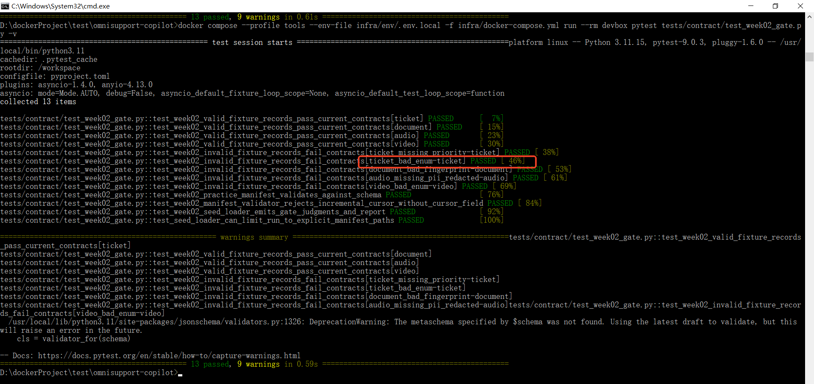

---

## 3. 入湖与补数（阶段三）
- 制造的缺口：在raw_ticket_event和ticket_fact表中删除了最后10条数据
- 补数命令与结果
```bash
# Step 1: 补数
docker compose --profile tools --env-file infra/env/.env.local -f infra/docker-compose.yml run --rm devbox python -m pipelines.ingestion.replay_backfill --mode backfill --source-id structured:tickets:seed_batch_001 --batch-id homework01-backfill-ticket-001 --start-cursor 2026-04-17T00:00:00Z --end-cursor 2026-04-17T23:59:59Z --input data/canonization/tickets/tickets-seed-001.jsonl --execute --report-json reports/homework01/recovery_execute_log.json

# Step 2: 重新 materialize
docker compose --profile tools --env-file infra/env/.env.local -f infra/docker-compose.yml run --rm devbox python -m pipelines.lakehouse.materialize --all-core --report-json reports/homework01/materialization_report.json
```
补数后结果：补数成功，无重复数据插入
- 幂等如何保证： `raw_ticket_event` 按 `source_id + source_fingerprint` 做幂等保护，同一份 JSONL 重跑不会让 Bronze 翻倍。

---

## 4. 时间旅行与基线（阶段四）

- 补数前/后快照 id：
  - 补数前：3596329793523767330
  - 补数后：1881286456487208629
  
- 性能基线关键数字

| 表 | 行数 | 快照数 | 文件数 | 平均文件大小 |
|---|---:|---:|---:|---:|
| bronze.raw_ticket_event | 500 | 17 | 1 | 81,382 B |
| bronze.raw_doc_asset | 1 | 15 | 1 | 6,242 B |
| silver.ticket_fact | 500 | 11 | 1 | 28,443 B |
| silver.knowledge_doc | 1 | 15 | 1 | 6,671 B |

---

## 5. dbt + 注册表 + 工具（阶段五）

- 改动文件清单

| 文件 | 改动 |
|------|------|
| [analytics/models/intermediate/int_ticket_activity_daily.sql](file:///d:/dockerProject/test/omnisupport-copilot/analytics/models/intermediate/int_ticket_activity_daily.sql) | 新增 `resolution_rate` 计算字段 |
| [analytics/models/marts/support_kpi_mart.sql](file:///d:/dockerProject/test/omnisupport-copilot/analytics/models/marts/support_kpi_mart.sql) | 新增 `resolution_rate` 行到 `cross join lateral values(...)` |
| [analytics/models/marts/agent_tool_input_view.sql](file:///d:/dockerProject/test/omnisupport-copilot/analytics/models/marts/agent_tool_input_view.sql) | `WHERE metric_name IN (...)` 列表加入 `resolution_rate` |
| [analytics/models/marts/schema.yml](file:///d:/dockerProject/test/omnisupport-copilot/analytics/models/marts/schema.yml) | `accepted_values` 测试加入 `resolution_rate` |
| [analytics/metric_registry_v1.yml](file:///d:/dockerProject/test/omnisupport-copilot/analytics/metric_registry_v1.yml) | 新增 `resolution_rate` 指标定义（v1.1 完整字段） |
| [analytics/scripts/validate_metric_registry.py](file:///d:/dockerProject/test/omnisupport-copilot/analytics/scripts/validate_metric_registry.py) | `SAFE_VIEW_METRICS` 白名单加入 `resolution_rate` |
| [contracts/tools/tools/query_support_kpis_v1.json](file:///d:/dockerProject/test/omnisupport-copilot/contracts/tools/tools/query_support_kpis_v1.json) | `metrics.maxItems` 从 11 调至 20 |

- dbt build 结果
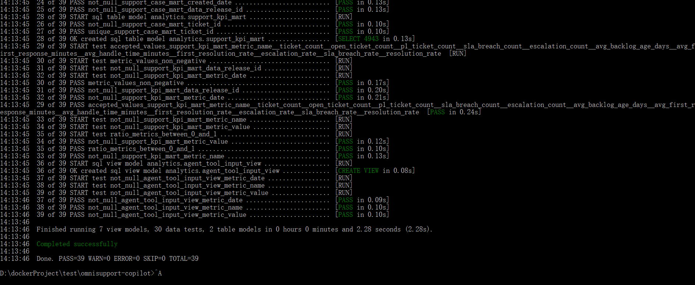

- Week05 测试结果
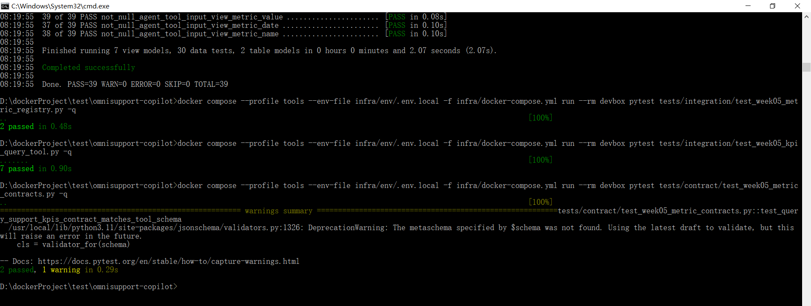

- 注册表登记片段

```yaml
  - name: resolution_rate
    label: "Resolution Rate"
    business_name_zh: "工单解决率"
    description: "Resolved tickets divided by created tickets in the selected window."
    business_definition_zh: "解决工单量 / 工单量。"
    owner: support_ops
    metric_type: ratio
    formula: "resolved_ticket_count / ticket_count"
    numerator: resolved_ticket_count
    denominator: ticket_count
    aggregation: avg
    unit: ratio
    sensitivity: low
    definition_status: production
    version: 1.1.0
    allowed_roles: ["support_ops", "instructor", "admin"]
    quality_tests: ["between_0_and_1"]
```

---

## 6. 端到端演示（阶段六）
- 演示截图
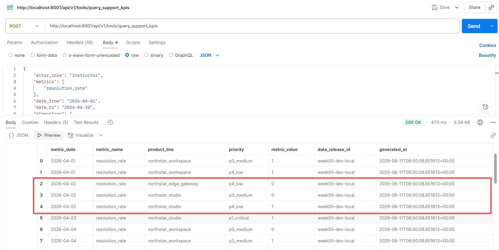
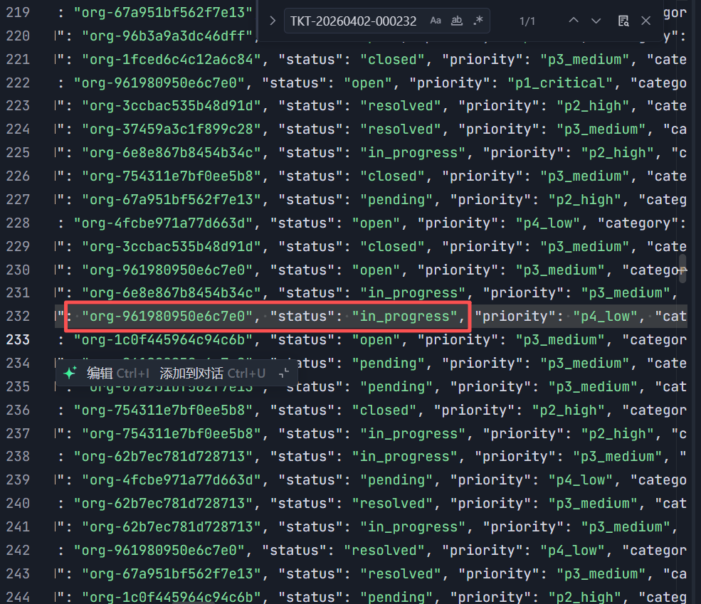
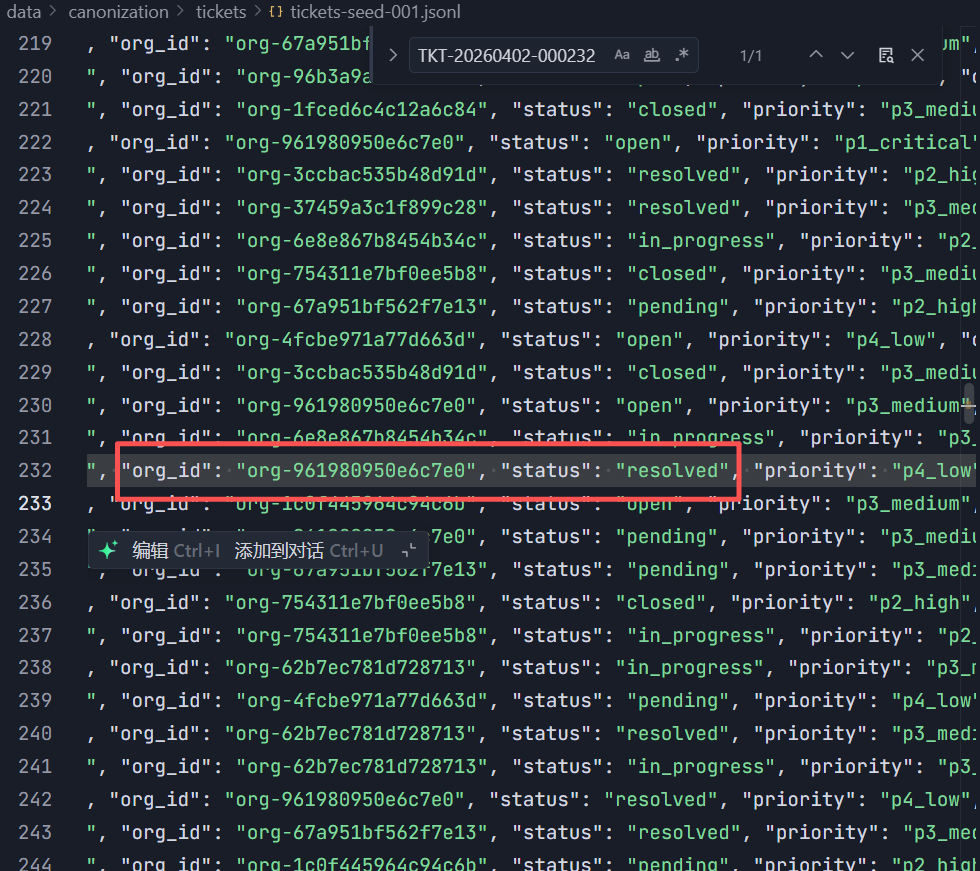
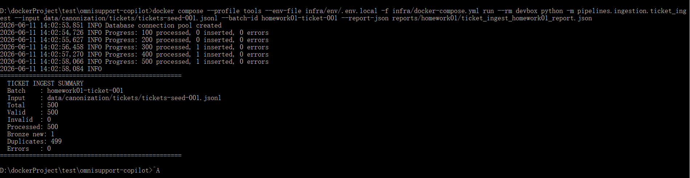
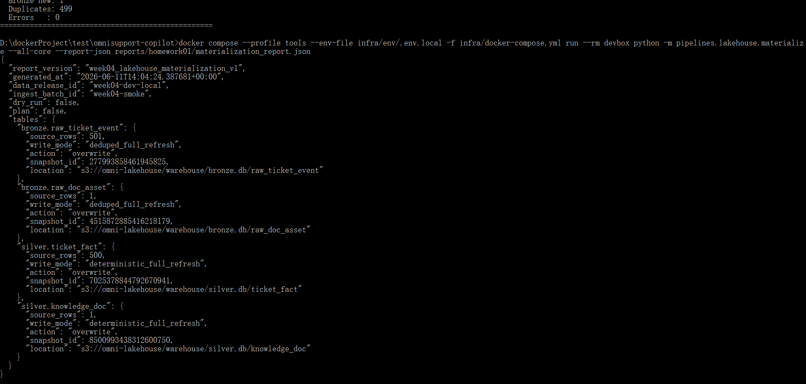
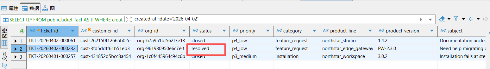
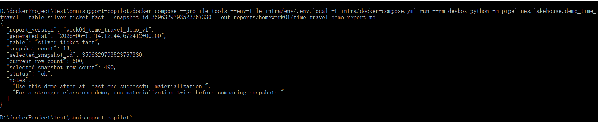

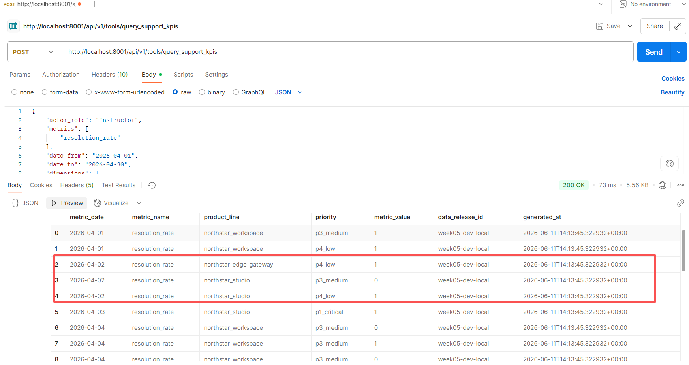
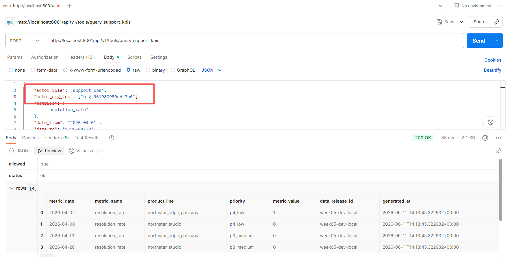
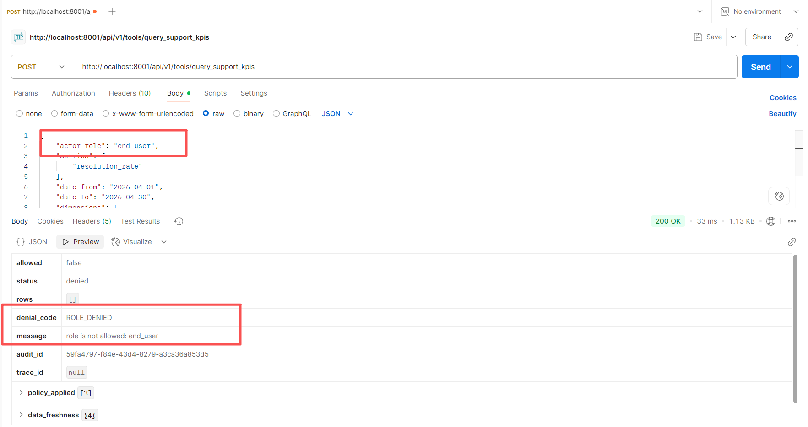

- 有权限查询结果


- 越权被拒的 denial_code


---

## 7. 我踩的坑 / 我的思考（加分项）

### 我踩的坑

1. **SAFE_VIEW_METRICS 白名单漏同步**：在 `metric_registry_v1.yml` 和 `agent_tool_input_view.sql` 都加了 `resolution_rate`，但 `validate_metric_registry.py` 的硬编码白名单没更新，导致 `test_week05_metric_registry.py` 报 `"metric is not allowed by safe view metric list: resolution_rate"`。修复后通过。

2. **dbt schema.yml 的 accepted_values 测试漏同步**：`support_kpi_mart` 输出了 `resolution_rate` 行，但 `schema.yml` 的 `accepted_values` 枚举没有包含它，dbt build 报 `Got 1 result, configured to fail if != 0`。加上后 39/39 全过。

3. **audit_log 表虽然建了（ 001_init.sql ），但目前还没有代码往里面写数据，kpi_query.py 只把审计信息返回在 API 响应体里，没有任何 INSERT INTO audit_log 或数据库写入操作**

### 我的思考

- **新增一个指标需要同步 6 个文件**：mart SQL、safe view SQL、schema.yml 测试、metric registry、校验脚本白名单、tool contract 的 maxItems。任何一个漏了都会导致 CI 失败。这验证了"指标不是改一行 SQL 就完事"的课程设计意图。

- **契约门禁是活的**：从 JSON Schema 枚举校验 → pytest 可执行 gate → dbt accepted_values 测试 → registry 白名单校验，坏数据在每一层都会被拦截。`status='done'` 在 schema 层就被 `jsonschema.validate()` 精准拦下，不需要等到业务逻辑层。
